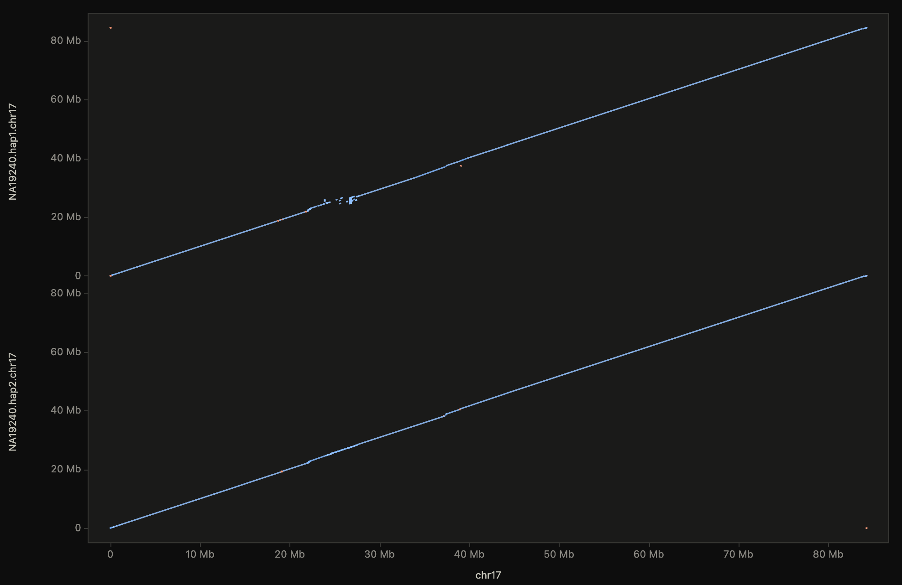
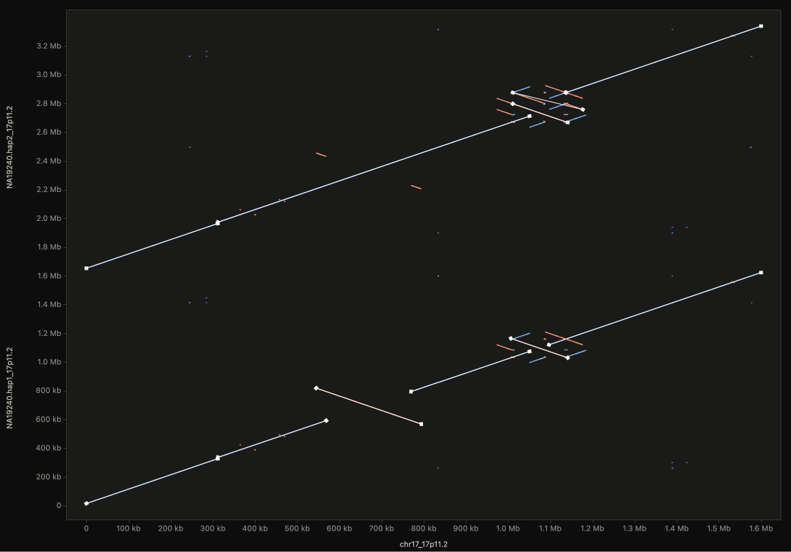
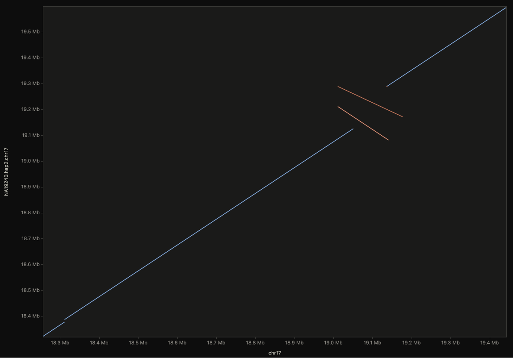
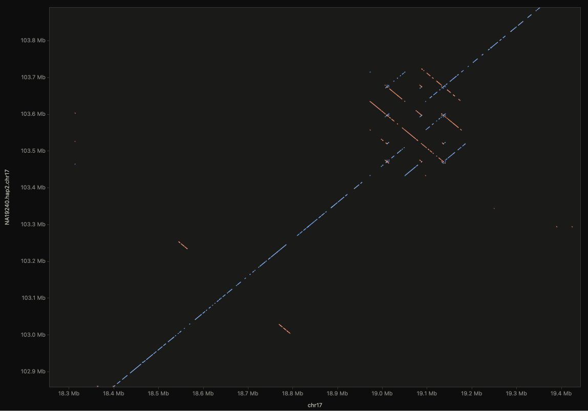
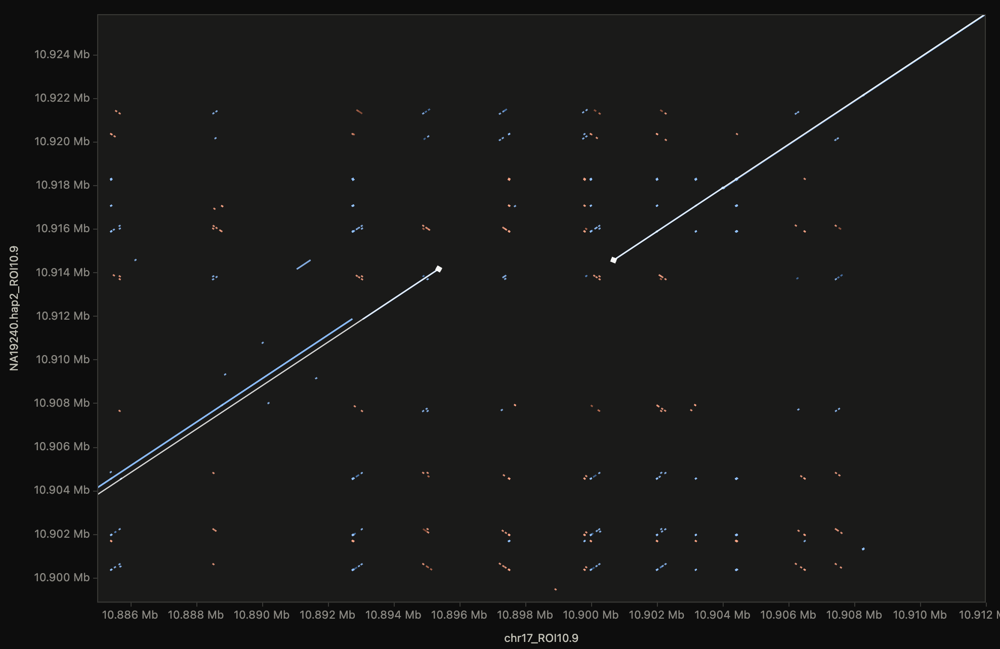
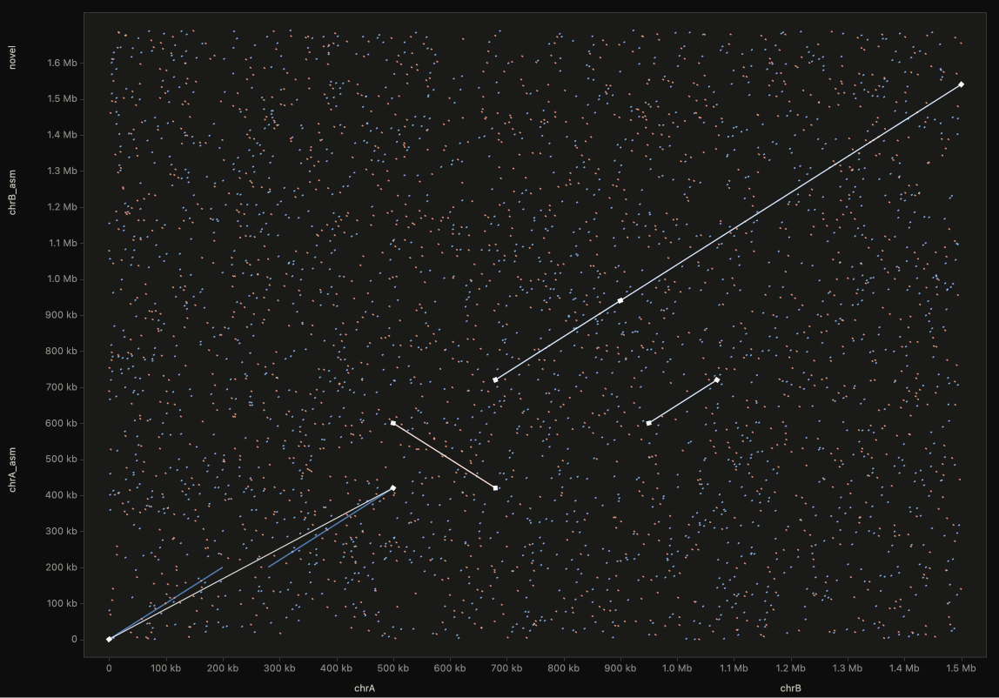

# dotdot

**Alignment-free, hyperperformant, interactive genomic dot plots — entirely in
your browser.**

Aligners are opinionated: chaining heuristics, breakpoint placement, mapping
filters and scoring choices all leave fingerprints on what you see — and
sometimes those fingerprints are artifacts. A dot plot built directly from
k-mer matches has no such opinions: it shows the raw sequence relationship,
which makes it both the most honest first look at two sequences *and* the
instrument for auditing what an aligner did to them.

dotdot is built around that idea. Drop FASTA files and its own engine computes
exact k-mer match plots — no aligner in the loop, chromosome scale included,
everything client-side (no server, no upload, no toolchain). Optionally, load
any aligner's PAF on the same axes to inspect its calls against raw sequence
structure.



*Above: real data — T2T-CHM13v2.0 chr17 (84.3 Mb) vs. both chr17 haplotypes of
the HPRC Release 2 NA19240 assembly, from minimap2 PAF. Reproduce it with
`scripts/fetch_realdata.sh`.*

## Highlights

- **Alignment-free k-mer engine, chromosome scale** — packed k-mers
  (**k = 4–26**: bitwise uint32 up to 16, exact-integer double packing above)
  in a bucketed, sorted index; anchors merge into diagonal runs with
  configurable mismatch bridging (`bridge gaps`) and per-sequence-pair
  boundary discipline. At genome scale it manages itself: two-sided sampling,
  a repeat cutoff computed from the index's own occurrence histogram (no
  guessed thresholds), and evidence-based run filtering. Runs off the main
  thread — cancellable, with live progress — and fans out across CPU cores
  via SharedArrayBuffer wherever the host serves cross-origin isolation
  headers (the bundled dev server does).
- **Progressive detail: coarse → zoom → Refine** — sampling is automatic by
  default but fully user-controllable (`auto`, `off`, or any pinned value),
  and **Refine view** recomputes the *visible window* at full density and
  merges it into the plot in place: whole-chromosome context stays coarse,
  the region you're inspecting becomes exact, and axes/zoom/overlay never
  move. Measured: refining a 108 kb window took it from 834 to 34,096
  segments while the rest of the plot stayed put.
- **Aligner audit via PAF** — load any PAF-emitting aligner's output
  (minimap2 etc., optionally gzipped; numbers parsed straight from bytes).
  Dropped onto an existing plot it becomes an **overlay**: the aligner's
  calls drawn as ink lines with diamond breakpoint markers *on top of* the
  alignment-free layer, so chained-over indels, missed copies, and breakpoint
  placement disagree with the raw sequence structure in plain sight. On an
  empty app a PAF plots standalone, colored by `nmatch/alnlen` identity.
  Measured standalone: a 160 MB PAF with **2,000,000 alignments loads in
  ~13 s** and pans and zooms at **native refresh rate (120 fps)**.
- **True genome-scale precision** — coordinates are carried as split float
  pairs into WebGL (relative-to-center, Sterbenz-exact), so the view stays
  sub-bp crisp at position 2,950,000,000 as at position 100. Axis ticks switch
  to exact base-pair labels at deep zoom.
- **One instanced draw** — every match is a GPU instance; strand visibility,
  identity and length filters are uniforms, so toggling them re-renders without
  re-uploading.
- **Colorblind-safe by construction** — forward/reverse = blue/orange
  (validated: worst CVD ΔE 24.7, normal-vision 33.6, ≥3:1 contrast, both
  themes), with perceptual OKLab identity ramps. Light and dark themes follow
  the OS.
- **Interactive** — drag pan, pinch / wheel / two-finger-scroll zoom
  (Alt = x-only), on-plot **+/−/fit** buttons, shift-drag box zoom,
  double-click zoom, hover tooltips with per-sequence coordinates, crosshair
  readout, keyboard shortcuts (`R` fit, `G` region box, `1`/`2` strand
  toggles, `P` fps meter) — and a clickable **?** popover on every control,
  with the header **?** as the full cheat-sheet. All matching/display fields
  take free values (`1kb`, `2,500`, `off`) with presets as suggestions.
- **Region jump** (`G`) — type `chr17:18.3M-19.4M` (or a sequence name, or a
  `?region=` URL parameter) and the view frames that target range with the
  query side derived from what actually maps there; when a region maps to
  several places (the other haplotype, duplications), pressing Go again cycles
  through them.
- **Exports** — composite PNG at device resolution, and true-vector SVG of the
  current view for figures (capped at 60 k visible segments).
- Transparent **gzip** support everywhere via native `DecompressionStream`.

## Quick start

No installation. Serve the repo statically and open it:

```bash
python3 scripts/serve.py
```

Then visit <http://127.0.0.1:8420/> and click **Demo: chr17 loci** — real
data, computed alignment-free in your browser: two committed slices of
T2T-CHM13 chr17 against the corresponding regions of both NA19240
haplotypes, with minimap2's calls arriving as the audit overlay.

- **17p11.2** (chr17:18.0–19.6 Mb): a heterozygous SV pair — a 250 kb
  inversion on hap1 and an inverted duplication on hap2 (orange
  anti-diagonals).
- **ROI10.9** (chr17:10.75–11.05 Mb): a heterozygous **~4.9 kb deletion** at
  chr17:10.895 Mb — hap2's diagonal steps sideways while hap1 runs straight
  through. Jump to it with `G` → `chr17_ROI10.9:130k-170k`.

**Full chr17** runs the whole-chromosome comparison — alignment-free
whenever the fetched FASTAs are present (`scripts/fetch_realdata.sh`),
falling back to the committed aligner PAF on a fresh clone. The intended
rhythm at that scale: let the coarse auto-sampled pass finish, pan the
overview, zoom into anything interesting, and hit **Refine view** for exact
local detail.



Any static file server hosts dotdot as-is (GitHub Pages included). The
bundled server also sends `Cross-Origin-Opener-Policy: same-origin` and
`Cross-Origin-Embedder-Policy: require-corp` — with those headers (Netlify and
Cloudflare Pages can set them; GitHub Pages cannot) the k-mer engine matches
on all CPU cores; without them it runs the identical single-worker path.

### Loading data

| Input | How |
|---|---|
| One FASTA | self dot plot (repeats, palindromes, satellite structure) |
| Two FASTAs | first = target (x), second = query (y) — alignment-free, the primary path |
| PAF / PAF.gz | optional aligner audit: any PAF-emitting aligner's output on the same axes |
| URL parameters | `?demo=1` · `?target=<url>&query=<url>[&overlay=<paf-url>]` · `?paf=<url>` · plus `k=`, `gap=`, `occ=`, `region=` |

Practical envelope: up to ~50 Mb of combined sequence the engine runs dense
and exact (bacteria, fungi, chromosome pairs, plasmids, viral genomes).
Beyond that it switches itself into a sampled genome mode — target-index
striding, query-position sampling, an occurrence cutoff chosen from the
index's own repeat histogram to meet an anchor budget, and a minimum-evidence
run filter — which carries it to full human chromosomes (see below), with
multi-core matching when cross-origin isolation is available. Try the
committed sample:
[`?target=testdata/target.fa&query=testdata/query.fa`](http://127.0.0.1:8420/?target=testdata/target.fa&query=testdata/query.fa)
(regenerate the FASTAs with `scripts/make_testdata.py`).

## Real data at scale: chr17 vs. NA19240

`scripts/fetch_realdata.sh` pulls T2T-CHM13v2.0 chr17 (RefSeq) plus the two
chr17 haplotype sequences of the **HPRC Release 2 NA19240** assembly (ranged
requests fetch just those sequences from the 1.8 GB assembly files). Measured
on an Apple-silicon laptop:

- **Alignment-free** — the full 84.3 Mb × 170 Mb comparison straight from
  FASTA completes in minutes, yielding ~2.3 M evidence-filtered match
  segments that pan and zoom at ~100 fps (auto-sampled, repeat cutoff picked
  from the occurrence histogram; with cross-origin isolation the matching
  phase spreads across all cores). Dense results pick a sane display
  length-filter automatically — drag it down for the repeat fabric, up for
  pure chromosome structure, and **Refine view** for exact local detail
  wherever you've zoomed. At `chr17:18.3M-19.4M` the raw k-mer view resolves
  a textbook heterozygous SV — hap1 carries a clean 250 kb inversion at
  17p11.2 while hap2 is collinear there but carries an inverted duplication
  at 19.0–19.2 Mb — including the internal paralog lattice that chained
  alignments summarize away. One `Go` keypress flips between the two
  haplotypes' views.
- **Aligner audit** — the same pair through `minimap2 -cx asm5` gives 847
  alignments (19 inversions) that load instantly; compare its breakpoint
  calls and its view of the segdup lattice against the k-mer truth above.

| hap1: 250 kb inversion (aligner PAF) | same window, alignment-free (hap2) |
|---|---|
|  |  |

One-click versions of this dataset live on the demo buttons: **Demo: chr17
loci** (committed 1.7 MB of gzipped FASTA — always alignment-free, including
the heterozygous 4.9 kb deletion at chr17:10.895 Mb) and **Full chr17**
(alignment-free when `scripts/fetch_realdata.sh` has run; the committed
574 kB minimap2 PAF otherwise).

## Progressive detail: sampling and Refine view

At chromosome scale the engine samples (the `sampling` field: `auto` sizes it
to the data, `off` forces full density, any number pins it). That makes the
overview fast — and the **Refine view** button closes the loop: it recomputes
the currently visible window at full density and merges the result in place,
so the plot stays one continuous coordinate space with coarse context
everywhere and exact k-mer structure where you're looking. Below, the
demo's heterozygous ~4.9 kb deletion after refining: hap2's diagonal halts at
a breakpoint diamond, jumps ~5 kb across reference-only sequence with zero
query advance, and resumes.



## Auditing an aligner

Load FASTAs (or run a demo), then drop a PAF on top — or use
`?target=…&query=…&overlay=aln.paf`. The aligner's calls draw as ink lines
with diamond breakpoint markers over the alignment-free layer:



Even on the synthetic demo pair the overlay earns its keep: minimap2 reports
the deletion-spanning region as *one* alignment, so its call runs straight
from end to end while the k-mer layer shows the two offset collinear blocks
it glued together — exactly the class of aligner summarization a dot plot
makes visible. Toggle the overlay with **show aligner overlay**; the base
plot's strand/identity/length filters never touch it.

A note on the timings in this README: they were measured inside an embedded,
*background-throttled* browser pane that granted the page a fraction of one
CPU core — treat them as generous upper bounds on what a foreground tab does.

### Reading the plot

- x = target position, y = query position, laid out per sequence
  (length-descending) with boundary gridlines and names on the axes.
- Blue = forward matches; orange = reverse-complement matches (anti-diagonals
  are inversions). Color depth encodes identity — darker is more identical in
  light mode, brighter in dark mode.
- Broken diagonals are indels; off-diagonal blocks are duplications or
  translocations; vertical/horizontal dashed columns are repeats hitting the
  occurrence cap.

## Architecture

```
js/
├── core/        dna packing · k-mer index+matcher · camera · picking grid · catalogs · regions
├── io/          FASTA and PAF parsers (byte-level), gzip
├── worker/      compute coordinator (parse → index → match/plan) · pooled matcher
├── render/      WebGL2 instanced renderer · shaders · OKLab colormaps · 2D axes chrome
├── export/      PNG compositor · SVG builder
└── main.js      UI wiring, interactions, worker pool, render loop
```

Design notes, for the curious:

- **No dependencies, no build.** Plain ES modules with JSDoc types
  (`jsconfig.json` gives editors full type checking; CI runs `deno check` on
  GitHub's runners — nothing ever installs locally).
- **Structure-of-arrays everywhere.** Segments live in typed arrays
  (`x`, `y`, `dx`, `dy`, `strand`, `identity`); the hot paths allocate nothing.
- **The index** counts k-mers into high-bit buckets (counting sort), fills, then
  sorts each bucket by full k-mer so lookups are a binary search plus a
  contiguous occurrence group — robust even against low-complexity sequence.
- **Run merging** happens in an open-addressed hash keyed by diagonal, bridging
  gaps ≤ N bp with identity bookkeeping, and never across sequence boundaries
  on either axis.
- **Picking** uses a uniform grid built by Amanatides–Woo traversal of each
  segment, queried in world space and scored in screen space.

## Development

```bash
python3 scripts/serve.py                # dev server (no-cache + COOP/COEP) on :8420
open http://127.0.0.1:8420/tests/           # run the test suite in the browser
open http://127.0.0.1:8420/tests/typecheck.html   # strict typecheck in the browser
```

- Tests are dependency-free dual-runtime suites: the same files run in the
  browser page and under `deno test tests/` in CI (68 tests: engine
  coordinates on both strands and all k, reverse-complement mapping, gap
  bridging, boundary discipline, range-restricted indexing/matching, parsers,
  camera math, picking, region expressions, colormap monotonicity,
  formatting).
- `tests/typecheck.html` runs the real TypeScript compiler (fetched from a
  CDN at dev time — nothing installs) over the same entry points CI checks
  with `deno check`, so type errors surface locally on a machine with no
  JavaScript runtime at all.
- `scripts/make_testdata.py` regenerates the synthetic assembly pair
  (`testdata/*.fa`, git-ignored) used to produce `testdata/example.paf` with
  minimap2; `scripts/fetch_realdata.sh` fetches the chr17 / NA19240 example.
- `testdata/bigcoord.paf` exercises Gb-scale coordinate precision.

## Credits

dotdot was designed, implemented, and verified in collaboration with
**Claude (Fable 5, Anthropic)** working in Claude Code — engine and renderer
design, the aligner-audit concept's implementation, in-browser testing, and
the real-data analyses in this README came out of that pairing, with
direction, domain judgment, and the aligner-agnostic thesis from the project
author.

Data and tools this project gratefully builds on: the
[T2T Consortium](https://github.com/marbl/CHM13)'s CHM13v2.0 reference, the
[Human Pangenome Reference Consortium](https://humanpangenome.org/)'s
Release 2 NA19240 assembly, [minimap2](https://github.com/lh3/minimap2)
(Heng Li) as the audited aligner, and NCBI/UCSC data services.

## License

Not yet chosen — add one before publishing.
