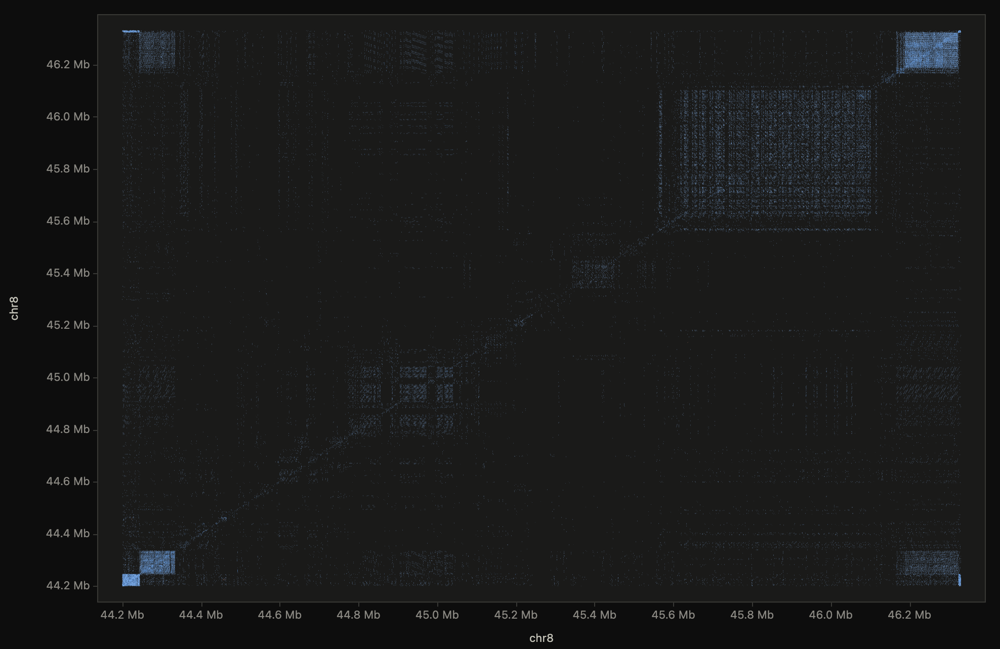
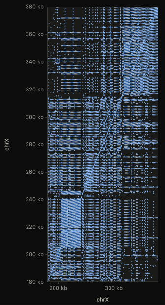
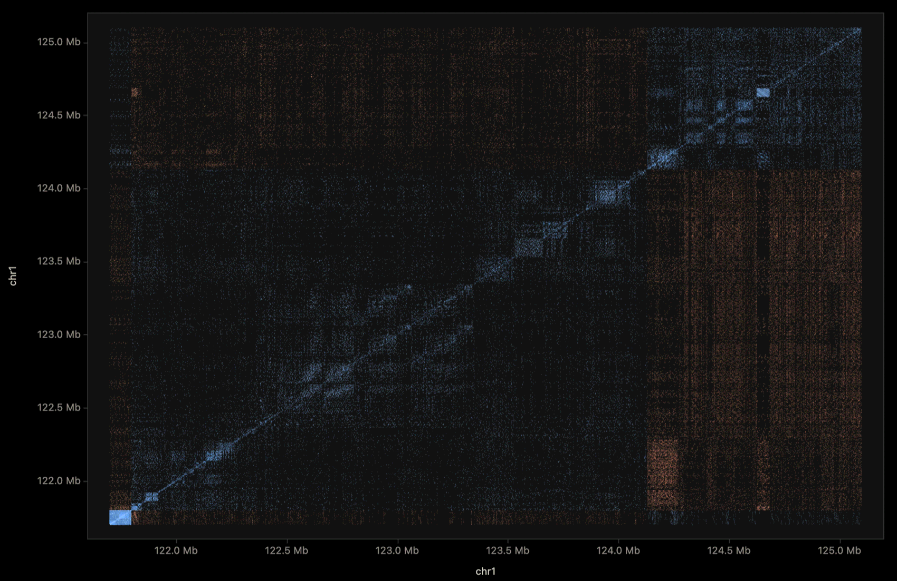
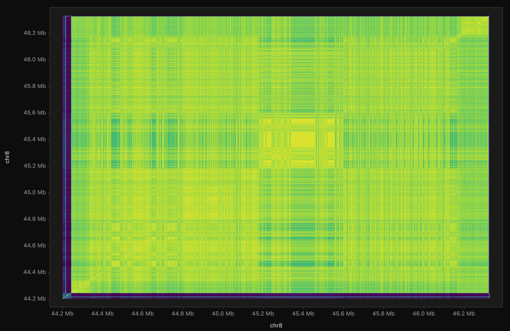
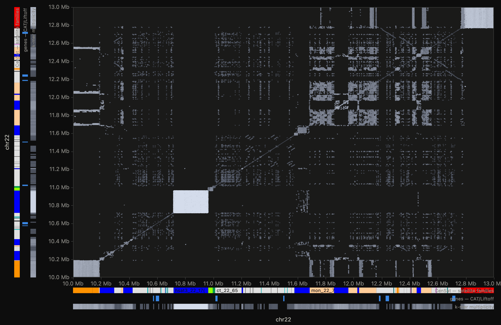

# dotdot

**Alignment-free, hyperperformant, interactive genomic dot plots — entirely in
your browser.**

Aligners are opinionated: chaining heuristics, breakpoint placement, mapping
filters and scoring choices all leave fingerprints on what you see — and
sometimes those fingerprints are artifacts. A dot plot built directly from
k-mer matches has no such opinions: it shows the raw sequence relationship,
which makes it both the most honest first look at two sequences *and* the
instrument for auditing what an aligner did to them.

dotdot is built around that idea. Drop FASTA files and its own engine computes
exact k-mer match plots — no aligner in the loop, chromosome scale included,
everything client-side (no server, no upload, no toolchain). Optionally, load
any aligner's PAF on the same axes to inspect its calls against raw sequence
structure.



*Above: the **chr8 centromere** (T2T-CHM13v2.0, chr8:44.2–46.33 Mb) compared
against itself — ~400,000 match segments computed **alignment-free in your
browser** from a 2.1 Mb window streamed on demand out of UCSC's 2bit.
α-satellite higher-order-repeat arrays read as woven blocks, nested domains
layer the core, and the flanking arrays mirror each other corner to corner —
no aligner touched any of it. The margin lanes are live **UCSC annotation
tracks** (also streamed, as bigBed byte ranges): CenSat names the structure
— the red band is the `hor_8_2(S2C8H1L)` α-satellite array itself. Open the
same view live:
[`?ref=t2t&refregion=chr8:44.2M-46.33M`](https://jlanej.github.io/dotdot/?ref=t2t&refregion=chr8:44.2M-46.33M).*

## Highlights

- **Alignment-free k-mer engine, chromosome scale** — packed k-mers
  (**k = 4–26**: bitwise uint32 up to 16, exact-integer double packing above)
  in a bucketed, sorted index; anchors merge into diagonal runs with
  configurable mismatch bridging (`bridge gaps`) and per-sequence-pair
  boundary discipline. At genome scale it manages itself: two-sided sampling,
  a repeat cutoff computed from the index's own occurrence histogram (no
  guessed thresholds), and evidence-based run filtering. Runs off the main
  thread — cancellable, with live progress — and fans out across CPU cores
  via SharedArrayBuffer wherever the host serves cross-origin isolation
  headers (the bundled dev server does).
- **Progressive detail: coarse → zoom → Refine** — sampling is automatic by
  default but fully user-controllable (`auto`, `off`, or any pinned value),
  and **Refine view** recomputes the *visible window* at full density —
  fanned out across CPU cores like any other compute — and merges it into
  the plot in place: whole-chromosome context stays coarse, the region
  you're inspecting becomes exact, and axes/zoom/overlay never move. Measured: refining a 108 kb window took it from 834 to 34,096
  segments while the rest of the plot stayed put.
- **Aligner audit via PAF** — load any PAF-emitting aligner's output
  (minimap2 etc., optionally gzipped; numbers parsed straight from bytes).
  Dropped onto an existing plot it becomes an **overlay**: the aligner's
  calls drawn as ink lines with diamond breakpoint markers *on top of* the
  alignment-free layer, so chained-over indels, missed copies, and breakpoint
  placement disagree with the raw sequence structure in plain sight. On an
  empty app a PAF plots standalone, colored by `nmatch/alnlen` identity.
  Measured standalone: a 160 MB PAF with **2,000,000 alignments loads in
  ~13 s** and pans and zooms at **native refresh rate (120 fps)**.
- **First-class reference genomes** — pick **T2T-CHM13v2.0** or **GRCh38**
  from a dropdown and type a genome-browser window
  (`chrX:57,820,000-60,670,000`); dotdot streams exactly that region from
  UCSC's public 2bit files over HTTP byte ranges — a 3 Mb centromere costs
  ~750 kB of transfer, and the genome itself never downloads. On its own the
  window **self-plots** (showcase presets default to satellite/HOR arrays);
  load a FASTA afterwards and it dots against the reference window. Axes,
  hover, and region jumps all speak **true genomic coordinates**, and that
  bookkeeping survives Refine view.
- **Three ways to read identity** — **segments** (every match a line, shaded
  by **anchor identity**: exact k-mer anchor coverage of each run —
  deliberately neither StainedGlass's alignment identity nor ModDotPlot's
  ANI, and named honestly everywhere); the **identity heatmap**
  (StainedGlass-style tile binning of the matches, with capped regions
  explicitly **hatched**); and the **ANI heatmap** — cap-free tile-pair
  identity by exact multiset containment, the satellite view that needs no
  enumeration at all (see below).
- **Honest by construction** — every approximation is either visible or
  consented to: capped repeat regions count in the scoreboard (and hatch in
  the identity-heatmap view), the
  effective cutoff prints in a note when it tightens, quadratic satellite
  windows are *predicted* from the occurrence histogram and asked about
  before the grind (with a one-click fix), exact mode over 128 Mb asks with a
  real RAM estimate instead of refusing, and `off` means off on every dial —
  occurrence cap, sampling, and anchor budget can each be truly disabled.
- **Annotation lanes from UCSC tracks** — CenSat satellite families (in the
  track's own colors), CAT/Liftoff genes, and SEDEF segmental duplications
  stream on demand as **bigBed byte ranges** into lanes along both axes, for
  any sequence named like a reference chromosome — streamed slices included,
  placed by their true coordinates. Fetches follow the view as you pan and
  zoom; the track files themselves never download. A fourth lane needs no
  download at all: **k-mer multiplicity** from the plot's own index — blank =
  unique-anchor territory, ink = repeat depth — for any FASTA, reference or
  not (and the same scale can color the whole plot).
- **True genome-scale precision** — coordinates are carried as split float
  pairs into WebGL (relative-to-center, Sterbenz-exact), so the view stays
  sub-bp crisp at position 2,950,000,000 as at position 100. Axis ticks switch
  to exact base-pair labels at deep zoom.
- **One instanced draw** — every match is a GPU instance; strand visibility,
  identity and length filters are uniforms, so toggling them re-renders without
  re-uploading.
- **Colorblind-safe by construction** — forward/reverse = blue/orange
  (validated: worst CVD ΔE 24.7, normal-vision 33.6, ≥3:1 contrast, both
  themes), with perceptual OKLab identity ramps. Light and dark themes follow
  the OS.
- **Interactive** — drag pan, pinch / wheel / two-finger-scroll zoom
  (Alt = x-only), on-plot **+/−/fit** buttons, shift-drag box zoom,
  double-click zoom, hover tooltips with per-sequence coordinates, crosshair
  readout, keyboard shortcuts (`R` fit, `F` refine, `[`/`]` detail ladder,
  `G` region box, `1`/`2` strand toggles, `P` fps meter) — and a clickable
  **?** popover on every control,
  with the header **?** as the full cheat-sheet. All matching/display fields
  take free values (`1kb`, `2,500`, `off`) with presets as suggestions. A
  live **composition widget** shows segments, aligned bp by strand, and
  compute throughput, with a one-click **Distributions** popup: segment
  lengths and identity by strand plus the index's **k-mer occurrence
  spectrum** — the repeat structure of the target at a glance.
- **Region jump** (`G`) — type `chr17:18.3M-19.4M` (or a sequence name, or a
  `?region=` URL parameter) and the view frames that target range with the
  query side derived from what actually maps there; when a region maps to
  several places (the other haplotype, duplications), pressing Go again cycles
  through them.
- **Exports** — composite PNG at device resolution, and true-vector SVG of the
  current view for figures (capped at 60 k visible segments).
- Transparent **gzip** support everywhere via native `DecompressionStream` —
  including multi-member **BGZF** (`bgzip`) files, walked block by block.

## Quick start

No installation. Serve the repo statically and open it:

```bash
python3 scripts/serve.py
```

Then visit <http://127.0.0.1:8420/> and click **chr17 loci demo** — real
data, computed alignment-free in your browser: two slices of T2T-CHM13
chr17, **streamed live from the reference** (committed copies are the
offline fallback), against the corresponding regions of both NA19240
haplotypes, with minimap2's calls arriving as the audit overlay.

- **17p11.2** (chr17:18.0–19.6 Mb): a heterozygous SV pair — a 250 kb
  inversion on hap1 and an inverted duplication on hap2 (orange
  anti-diagonals).
- **ROI10.9** (chr17:10.6–11.2 Mb): a heterozygous **~4.9 kb deletion** at
  chr17:10.895 Mb — hap2's diagonal steps sideways while hap1 runs straight
  through. Jump to it with `G` → `chr17_ROI10.9:10.88M-10.92M` (true
  coordinates work directly).

**full chr17 × NA19240** runs the whole-chromosome comparison — alignment-free
whenever the fetched FASTAs are present (`scripts/fetch_realdata.sh`),
falling back to the committed aligner PAF on a fresh clone. The intended
rhythm at that scale: let the coarse auto-sampled pass finish, pan the
overview, zoom into anything interesting, and hit **Refine view** for exact
local detail.


*The demo's 2×4 region lattice: every sequence rules its own true
coordinates, alternating shading separates regions, and minimap2's calls
(white ink, diamond breakpoints) ride on top of the alignment-free layer.*

## Showcase: repeat architecture straight from sequence

The regions aligners summarize away are where dot plots come alive. Every
view below is computed alignment-free in the browser from a streamed
reference window — open any of them live with one click.



*chrX **DXZ1** at full detail (chrX:58.10–58.34 Mb, after Refine): the most
homogeneous satellite array in the genome. Every diagonal stripe is one
~2 kb higher-order-repeat offset — 657k segments in a 250 kb window, woven
edge to edge. Live:
[`?ref=t2t&refregion=chrX:57.82M-60.67M`](https://jlanej.github.io/dotdot/?ref=t2t&refregion=chrX:57.82M-60.67M).*



*chr1's pericentromere (chr1:121.7–125.1 Mb): 1.55 M segments of α-satellite
and HSat blocks as a sharp-edged mosaic — including whole **inverted
domains** standing out in orange around 124.4–124.8 Mb. Live:
[`?ref=t2t&refregion=chr1:121.7M-125.1M`](https://jlanej.github.io/dotdot/?ref=t2t&refregion=chr1:121.7M-125.1M).*

## Identity without enumeration: the ANI heatmap

Satellite arrays are quadratic: N repeat copies really do match N² ways, so
the chr8 centromere alone would need ~6 *billion* anchor pairs — no segment
budget reaches that, and every dot-plot tool that caps repeat k-mers quietly
renders "too deep to enumerate" the same as "not similar". dotdot refuses the
lie twice. In the identity-heatmap view, capped regions wear an explicit
**hatch** ("not searched" — counted in the scoreboard in every mode, bought
back with the **repeat budget** dial). And the **ANI heatmap** draw mode
escapes the trap altogether: every pair of tiles in the visible window is
compared by the **multiset containment** of its exact k-mer counts, mapped to
ANI = c^(1/k) — no matches enumerated, no occurrence cap (windows past ~48 Mb
subsample both tiles' multisets uniformly, a symmetric estimate; zoom in and
the counts are exact). Per-group cost is bounded by the tiles a k-mer
touches — at worst tiles², never occurrences² — so the deepest satellite
core costs on the order of unique sequence.



*The same chr8 centromere as the headliner above, as a **1024×1024 cap-free
ANI mosaic** (2 kb per tile, seconds to compute): the youngest, most
homogeneous HOR block glows yellow around chr8:45.2–45.6 Mb, mid-identity
fabric reads green, diverged bands teal, and the divergent flanks edge the
array in purple — the full kinship structure of ~6 billion implied pairs,
none of them enumerated. Count-weighted containment is the accuracy edge of
an exact index: sketch-based set containment saturates in tandem arrays.
Resolution is per-window (zooming refines it), auto-sized to your display,
or pinned with the **ANI tiles** dial. Live:
[`?ref=t2t&refregion=chr8:44.2M-46.33M&anitiles=1024` + `draw=ani`](https://jlanej.github.io/dotdot/?ref=t2t&refregion=chr8%3A44.2M-46.33M&anitiles=1024#v=-63900-2193901:-63900-2193901&draw=ani).*

## Repeat structure at every level: k-mer multiplicity

Every alignment-free compute also profiles its own index: per 512 bp of
target, the geometric-mean **copy number** of its k-mers and the fraction
that are unique. That one profile powers a **k-mer multiplicity lane** along
the axes (ink darkens with log copy number; blank stretches are unique-anchor
territory — hover reads "~421× · 2% unique"), and a **color-by-multiplicity**
segment mode where the same scale paints the plot itself:



*chr22:10–13 Mb self-compared, segments **colored by k-mer multiplicity**:
the HSat3 block at 10.7–10.9 Mb blazes at full ink, segmental-duplication
lattices read mid-gray, and the unique diagonal recedes to a whisper —
repeat families as families, regardless of strand. The margin lanes agree:
CenSat names the blocks (`hsat3_22_17`, `mon_22_7`…) while the multiplicity
lane traces the same topology from the index alone — no annotation needed,
so it works on any FASTA. Live:
[`?ref=t2t&refregion=chr22:10M-13M` + `len=100&col=2`](https://jlanej.github.io/dotdot/?ref=t2t&refregion=chr22%3A10%2C000%2C000-13%2C000%2C000#v=0-3000001:0-3000001&len=100&col=2).*

### Reference genomes, no downloads

The **Reference** dropdown gives instant material with no files at all:
selecting **T2T-CHM13v2.0** streams its default showcase window — the DXZ1
alpha-satellite array pictured above — and self-plots it from ~750 kB of
streamed 2bit data. Type any window (`chr8:44.2M-46.33M`, `chr1:121,700,000-125,100,000` — k/M/G
units and commas welcome; a bare name loads the whole sequence), a
cytogenetic **arm** (`chr13p`, resolved from the streamed cytoband track),
or a **list** — `chr13p,chr14p,chr15p,chr21p,chr22p` lays all five
acrocentric short arms on one axis for a 70 Mb self-comparison of the
rDNA-bearing arms (also a showcase preset). **`vs` splits the axes**:
`chr21p vs chr22p` streams the left side as the target and the right side
as the query — the direct cross-comparison with no self quadrants, each
side a full list if you like (and the ANI heatmap works across it). Or pick any preset (chrX DXZ1,
chr8 and chr17 centromeres, a chr1 pericentromere, the acrocentrics). With a reference window loaded, added FASTAs dot **against
it** — the demo above is exactly that pattern. The axis rulers, hover, the
readout, and `G` region jumps all speak true genomic coordinates
(`chrX:58,000,000-58,200,000` works directly), and multi-sequence axes rule
each sequence in its own coordinates.

Any static file server hosts dotdot as-is (GitHub Pages included). The
bundled server also sends `Cross-Origin-Opener-Policy: same-origin` and
`Cross-Origin-Embedder-Policy: require-corp` — with those headers (Netlify and
Cloudflare Pages can set them; GitHub Pages cannot) the k-mer engine matches
on up to 8 CPU cores (two are left for the UI); without them it runs the
identical single-worker path.

### Loading data

| Input | How |
|---|---|
| One FASTA | self dot plot (repeats, palindromes, satellite structure) |
| Two FASTAs | first = target (x), second = query (y) — alignment-free, the primary path |
| Many FASTAs | file buttons multi-select to stack several files on one axis; dropping 3+ makes the first the target and the rest the query — each sequence keeps its own ruler, with alternating band shading separating regions |
| PAF / PAF.gz | optional aligner audit: any PAF-emitting aligner's output on the same axes |
| Reference dropdown | T2T-CHM13v2.0 / GRCh38 windows streamed from UCSC 2bit files — self-plot, or the target for added FASTAs |
| URL parameters | `?demo=1` · `?ref=t2t&refregion=chrX:57.8M-60.7M` · `?target=<url>&query=<url>[&overlay=<paf-url>]` · `?paf=<url>` · plus `k=`, `gap=`, `occ=` (`off` = no repeat masking), `minrun=`, `sample=` (`off` = truly exact, `off 512M` pre-approves the RAM), `budget=` (`off` = unbounded anchors), `wall=` (raise the segment wall, to `64M`), `anitiles=`, `region=`, and a `#v=` view fragment carrying viewport, draw mode (`draw=heat`/`ani`), color mode, filters, and auto-refine |
| Share view | one click copies a link reproducing the exact data, viewport, draw and color modes, display settings, and non-default matching options — every finding becomes a URL |

Practical envelope: up to ~48 Mb of sequence per axis the engine runs dense
and exact (bacteria, fungi, chromosome pairs, plasmids, viral genomes).
Beyond that it switches itself into a sampled genome mode — target-index
striding, query-position sampling, an occurrence cutoff chosen from the
index's own repeat histogram to meet an anchor budget, and a minimum-evidence
run filter — which carries it to full human chromosomes (see below), with
multi-core matching when cross-origin isolation is available. Every one of
those dials also goes to a true **off**: `sampling: off` is genuinely exact
on both axes (guarded by a consent popup with the real RAM number past
128 Mb of target, pre-approvable as `off 512M`, engine wall at ~1 Gb), and
the occurrence cap and anchor budget disable outright — verified by the
self-plot litmus that every k-mer of chr22 indexes with zero cap leaks. Try
the bundled sample pair — generate the FASTAs once with
`scripts/make_testdata.py` (they are git-ignored), then open
[`?target=testdata/target.fa&query=testdata/query.fa`](http://127.0.0.1:8420/?target=testdata/target.fa&query=testdata/query.fa).

## Real data at scale: chr17 vs. NA19240

`scripts/fetch_realdata.sh` pulls T2T-CHM13v2.0 chr17 (RefSeq) plus the two
chr17 haplotype sequences of the **HPRC Release 2 NA19240** assembly (ranged
requests fetch just those sequences from the 1.8 GB assembly files). Measured
on an Apple-silicon laptop:

- **Alignment-free** — the full 84.3 Mb × 170 Mb comparison straight from
  FASTA completes in minutes, yielding ~2.3 M evidence-filtered match
  segments that pan and zoom at ~100 fps (auto-sampled, repeat cutoff picked
  from the occurrence histogram; with cross-origin isolation the matching
  phase spreads across all cores). Dense results pick a sane display
  length-filter automatically — drag it down for the repeat fabric, up for
  pure chromosome structure, and **Refine view** for exact local detail
  wherever you've zoomed. At `chr17:18.3M-19.4M` the raw k-mer view resolves
  a textbook heterozygous SV — hap1 carries a clean 250 kb inversion at
  17p11.2 while hap2 is collinear there but carries an inverted duplication
  at 19.0–19.2 Mb — including the internal paralog lattice that chained
  alignments summarize away. One `Go` keypress flips between the two
  haplotypes' views.
- **Aligner audit** — the same pair through `minimap2 -cx asm5` gives 847
  alignments (19 inversions) that load instantly; compare its breakpoint
  calls and its view of the segdup lattice against the k-mer truth above.


*The PAF path at chromosome scale: minimap2's 847 chr17 alignments across
both haplotype bands, loaded standalone in under a second — each band ruled
in its own coordinates.*

One-click versions of this dataset live on the demo buttons: **chr17 loci
demo** (target slices streamed live from the T2T reference, committed
copies as the offline fallback — always alignment-free, including the
heterozygous 4.9 kb deletion at chr17:10.895 Mb) and **full chr17 ×
NA19240** (alignment-free when `scripts/fetch_realdata.sh` has run; the
committed 574 kB minimap2 PAF otherwise).

## Progressive detail: sampling and Refine view

At chromosome scale the engine samples (the `sampling` field: `auto` sizes it
to the data, any number pins the query-side interval, and `off` is **true
full density on both axes** — consent-gated past 128 Mb of target rather
than silently degraded). That makes the overview fast — and **Refine view**
closes the loop: it recomputes the
currently visible window at full density and merges the result in place, so
the plot stays one continuous coordinate space with coarse context everywhere
and exact k-mer structure where you're looking. The **Detail** panel keeps
the loop at your fingertips: the min-segment-length dial (slider, exact
value, or `[`/`]` from the plot) sweeps repeat fabric ↔ structure live, `F`
or the on-plot ✦ refines, and checking **auto** refines by itself whenever
you rest at a zoomed view. Below, the demo's heterozygous **~4.9 kb
deletion** at full detail, in true coordinates on both axes: hap2's k-mer
diagonal halts at chr17:10,895,377, steps ~5 kb sideways across
reference-only sequence with zero query advance, and resumes — while
minimap2's deletion-spanning call (white ink) rides the same path, its two
breakpoint diamonds flanking the gap exactly.


## Auditing an aligner

Load FASTAs (or run a demo), then drop a PAF on top — or use
`?target=…&query=…&overlay=aln.paf`. The aligner's calls draw as ink lines
with diamond breakpoint markers over the alignment-free layer:


*The demo's 17p11.2 locus (chr17:18.54–18.87 Mb vs NA19240 hap1): minimap2
reports the region as one clean **250 kb inversion** — the white
anti-diagonal with its two breakpoint diamonds — and the raw k-mer layer
shows everything that single call summarizes away: a dense woven lattice of
forward (blue) and inverted (orange) segmental-duplication paralogs the
inversion actually lives in.*

That is the audit in one picture: the aligner's call is *correct*, and it is
also a summary — chained alignments compress repeat architecture into single
lines, and breakpoints land where the chaining says, not always where the
sequence says. The overlay keeps both truths on screen at once. Toggle it
with **show aligner overlay**; the base plot's strand/identity/length
filters never touch it.

A note on the timings in this README: they were measured inside an embedded,
*background-throttled* browser pane that granted the page a fraction of one
CPU core — treat them as generous upper bounds on what a foreground tab does.

### Reading the plot

- x = target position, y = query position, laid out per sequence
  (length-descending) with boundary gridlines and names on the axes.
- Blue = forward matches; orange = reverse-complement matches (anti-diagonals
  are inversions). Color depth encodes **anchor identity** — the fraction of
  each merged run covered by exact k-mer anchors (bridged mismatch/indel bases
  count against it). It is deliberately neither alignment identity
  (StainedGlass) nor k-mer ANI (ModDotPlot); it derives from exact occurrence
  counts, no aligner involved. Darker is more identical in light mode,
  brighter in dark mode.
- Broken diagonals are indels; off-diagonal blocks are duplications or
  translocations; vertical/horizontal dashed columns are repeats hitting the
  occurrence cap.
- **Diagonal hatching** in the identity-heatmap view marks regions whose
  k-mers exceed the repeat cutoff: matches there were **never enumerated**,
  so an empty square means "not searched", not "not similar" — the classic
  dot-plot lie in satellite DNA, refused. The scoreboard counts the capped
  fraction, and a **repeat budget** control (2×/4×/8×/off) buys back depth
  where the repeat period allows it. Where it doesn't (period &lt; k), the
  **ANI heatmap** is the answer — it never enumerates, so it has no cap and
  no hatch.
- The **k-mer multiplicity lane** (and the matching segment color mode) reads
  repeat depth on a neutral→ink log scale: blank = unique-anchor territory,
  full ink ≈ 300×+ copies. The ANI heatmap uses a viridis-style multi-hue
  ramp so the narrow high-identity band of satellite arrays stays visually
  separable.

## Architecture

```
js/
├── core/        dna packing · k-mer index+matcher · camera · picking grid · catalogs · regions
├── io/          FASTA and PAF parsers (byte-level) · remote 2bit + bigBed readers · gzip
├── worker/      compute coordinator (parse → index → match/plan) · pooled matcher
├── render/      WebGL2 instanced renderer · shaders · OKLab colormaps · 2D axes chrome
├── export/      PNG compositor · SVG builder
└── main.js      UI wiring, interactions, worker pool, render loop
```

Design notes, for the curious:

- **No dependencies, no build.** Plain ES modules with JSDoc types
  (`jsconfig.json` gives editors full type checking; CI runs `deno check` on
  GitHub's runners — nothing ever installs locally).
- **Structure-of-arrays everywhere.** Segments live in typed arrays
  (`x`, `y`, `dx`, `dy`, `strand`, `identity`); the hot paths allocate nothing.
- **The index** counts k-mers into high-bit buckets (counting sort), fills, then
  sorts each bucket by full k-mer so lookups are a binary search plus a
  contiguous occurrence group — robust even against low-complexity sequence.
- **Run merging** happens in an open-addressed hash keyed by diagonal, bridging
  gaps ≤ N bp with identity bookkeeping, and never across sequence boundaries
  on either axis.
- **Picking** uses a uniform grid built by Amanatides–Woo traversal of each
  segment, queried in world space and scored in screen space.

## Development

```bash
python3 scripts/serve.py                # dev server (no-cache + COOP/COEP) on :8420
open http://127.0.0.1:8420/tests/           # run the test suite in the browser
open http://127.0.0.1:8420/tests/typecheck.html   # strict typecheck in the browser
```

- Tests are dependency-free dual-runtime suites: the same files run in the
  browser page and under `deno test tests/` in CI (146 tests: engine
  coordinates on both strands and all k, reverse-complement mapping, gap
  bridging, boundary discipline, range-restricted indexing/matching,
  multicore chunk-stitch parity against single-core, sampling/density
  resolution and the exact-mode guards, occurrence-cap semantics including
  true off, saturation intervals and hatch painting, the multiplicity
  profile and its ramps, multiset-containment ANI grids, share-hash
  round-trips, parsers, BGZF/gzip fixtures, 2bit and bigBed decoding against
  in-memory fixtures, camera math, picking, region expressions with
  true-coordinate offsets, colormap monotonicity, formatting).
- `tests/typecheck.html` runs the real TypeScript compiler (fetched from a
  CDN at dev time — nothing installs) over the same entry points CI checks
  with `deno check`, so type errors surface locally on a machine with no
  JavaScript runtime at all.
- `scripts/make_testdata.py` regenerates the synthetic assembly pair
  (`testdata/*.fa`, git-ignored) used to produce `testdata/example.paf` with
  minimap2; `scripts/fetch_realdata.sh` fetches the chr17 / NA19240 example;
  `scripts/make_demo.sh` regenerates the committed demo slices + overlay PAF
  from it (samtools + minimap2).
- `testdata/bigcoord.paf` exercises Gb-scale coordinate precision.

## Credits

dotdot was designed, implemented, and verified in collaboration with
**Claude (Fable 5, Anthropic)** working in Claude Code — engine and renderer
design, the aligner-audit concept's implementation, in-browser testing, and
the real-data analyses in this README came out of that pairing, with
direction, domain judgment, and the aligner-agnostic thesis from the project
author.

Data and tools this project gratefully builds on: the
[T2T Consortium](https://github.com/marbl/CHM13)'s CHM13v2.0 reference, the
[Human Pangenome Reference Consortium](https://humanpangenome.org/)'s
Release 2 NA19240 assembly, [minimap2](https://github.com/lh3/minimap2)
(Heng Li) as the audited aligner, and NCBI/UCSC data services.

## License

[MIT](LICENSE). The committed example data derive from openly released
resources (T2T-CHM13v2.0 via NCBI RefSeq; the NA19240 assembly from HPRC
Release 2) — see those projects for their data-use statements.
